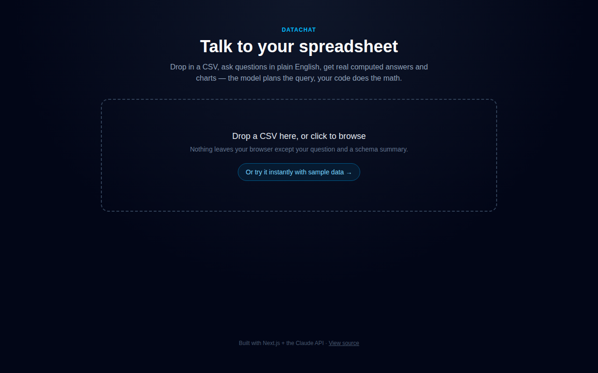

# DataChat

Ask a spreadsheet a question in plain English and get back a real, computed answer — not a
guess.



**[Try it live](https://datachat-1.vercel.app/)** — no login, no upload required, click "try it
instantly with sample data." · [Source](.)

## The problem

Most "chat with your data" demos paste a sample of rows into the prompt and let the model
eyeball an answer. That works for "what columns do I have," and quietly falls apart the moment
someone asks for a sum, an average, or a "top 10" — LLMs are unreliable at arithmetic over data
they can't fully see, and a wrong number that *sounds* confident is worse than no answer.

## The approach

Claude never does the math. It plans the query; plain TypeScript executes it.

1. The browser parses the uploaded CSV and sends the model a **schema summary** — column names,
   types, a few sample values. Not the raw data.
2. Claude decides what computation answers the question by calling a `run_query` tool — `sum`,
   `average`, `groupby_sum`, `top_n`, a filtered count, etc. — and specifies the parameters.
3. A pure function executes that operation over the full (capped) dataset. No LLM involved.
4. Claude gets the real result back and writes the final answer using those exact numbers, and
   picks a chart if one would help.

This plan → execute → narrate shape is the same one production tools use when they sit an LLM on
top of customer data, which is why I built it this way rather than the simpler prompt-and-hope
version.

## Stack

Next.js 16 (App Router) · TypeScript · Tailwind CSS · Claude API (`@anthropic-ai/sdk`, tool use)
· Papaparse · Recharts · deployed on Vercel

## Running it locally

```bash
npm install
cp .env.example .env.local   # add your ANTHROPIC_API_KEY
npm run dev
```

Open `localhost:3000`. Either drop in your own CSV or click "try it instantly with sample data"
(510 rows, a dozen sales reps, a full year — the same dataset the live demo uses).

## Known limitations

- Rows are capped at 5,000 per question to keep the payload to the serverless function
  reasonable. Fine for a demo CSV, not a data warehouse.
- The whole (capped) dataset is sent to the API route on every question — a real product would
  push it into a database or DuckDB and have the model generate SQL instead of calling a fixed
  set of aggregation ops.
- No auth, no persistence. Uploads live only in the browser tab.